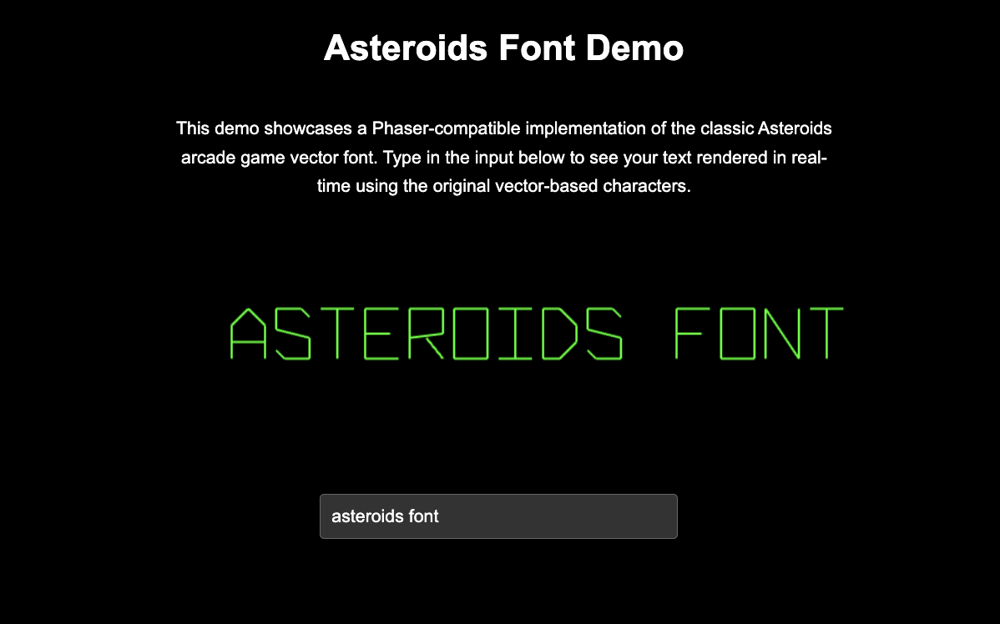

# Asteroids Vector Font for Phaser

A Phaser-compatible implementation of the classic Asteroids arcade game vector font. This library provides a pixel-perfect recreation of the original vector-based font used in Atari's 1979 Asteroids arcade game.

[](https://github.com/wolfyy970/Asteroids-Font)

## Features

- 🎮 Authentic recreation of the original Asteroids arcade font
- 🎯 Pixel-perfect vector rendering using Phaser's Graphics API
- ⚙️ Highly configurable:
  - Adjustable character size
  - Customizable letter spacing
  - Configurable line width and color
  - Scalable rendering
- 📦 No external dependencies beyond Phaser
- 💻 Modern ES6 module format

## Installation

```bash
# Clone the repository
git clone https://github.com/wolfyy970/asteroids-phaser-font.git

# Or install via npm (coming soon)
# npm install phaser-asteroids-font
```

## Quick Start

```javascript
import { AsteroidsFontRenderer } from './asteroids-font.js';

// In your Phaser scene:
class GameScene extends Phaser.Scene {
    create() {
        // Create the font renderer
        const font = new AsteroidsFontRenderer(this, {
            glyphWidth: 40,    // Width of each character
            glyphHeight: 60,   // Height of each character
            lineWidth: 2,      // Stroke thickness
            color: 0x00ff00,   // Classic green color
            letterSpacing: 10, // Space between characters
            scale: 1.0        // Overall scale factor
        });

        // Draw some text
        font.drawText(100, 100, "GAME OVER");
    }
}
```

## Configuration Options

| Option | Type | Default | Description |
|--------|------|---------|-------------|
| glyphWidth | number | 40 | Width of each character in pixels |
| glyphHeight | number | 60 | Height of each character in pixels |
| lineWidth | number | 2 | Stroke thickness of the vector lines |
| color | number | 0xffffff | Color of the font (hex value) |
| letterSpacing | number | 0 | Space between characters in pixels |
| scale | number | 1.0 | Overall scale factor for the font |

## Live Demo

Check out the [live demo](https://github.com/wolfyy970/Asteroids-Font) to see the font in action and try it yourself!

## Technical Details

The font implementation is based on the original vector data from the Asteroids arcade game. Each character is defined as a series of vector drawing commands on an 8×12 grid:

- Points are packed into bytes using a 4-bit x,y format
- Special commands (0xFE for "pen up", 0xFF for "end glyph")
- Vector-based rendering for crisp display at any size

## Attribution

This implementation is based on the Asteroids font data from the [vst project](https://github.com/osresearch/vst) by Trammell Hudson, specifically the teensyv/asteroids_font.c implementation. The original vector font was created by Atari for the 1979 Asteroids arcade game.

## License

This project is licensed under the MIT License - see the [LICENSE](LICENSE) file for details.

## Keywords

asteroids, arcade font, vector font, phaser, javascript, game development, retro gaming, atari, vector graphics

## Contributing

Contributions are welcome! Please feel free to submit a Pull Request.

1. Fork the repository
2. Create your feature branch (`git checkout -b feature/AmazingFeature`)
3. Commit your changes (`git commit -m 'Add some AmazingFeature'`)
4. Push to the branch (`git push origin feature/AmazingFeature`)
5. Open a Pull Request

## Support

If you find any issues or have questions, please [open an issue](https://github.com/wolfyy970/Asteroids-Font/issues) on GitHub.
